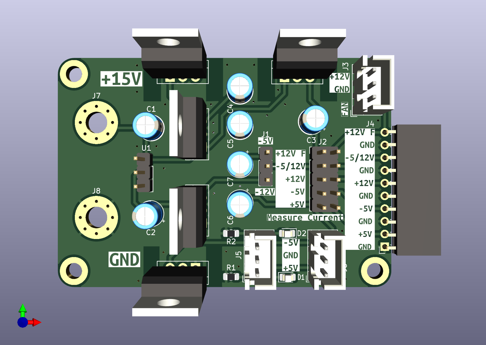
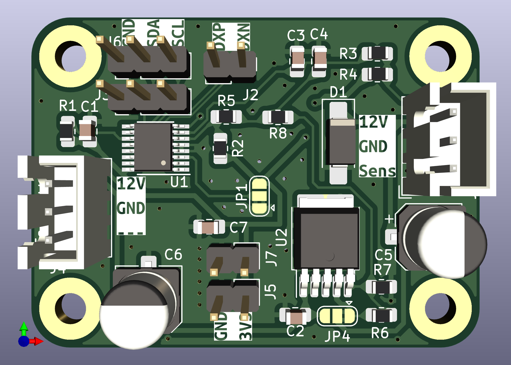

<!--
SPDX-FileCopyrightText: 2023 Jan Nieuwstad <jan.sources@nieuwstad.net>

SPDX-License-Identifier: CC-BY-SA-4.0
-->

# Overview

The DCL8010 electronic load module features a DC Electronic Load with several modes and protections.
This project is the for the development boards for this project.

## Specifications

* Modes: Constant Current (CC), Constant Voltage (CV), Constant Power (CP) and Constand Resistance (CR). CC and CV are implemented in hardware, CP and CR are software controlled and have a slower dynamic response.
* Limits:
  * Current: 1mA - 10A set and read
  * Voltage: 0.5V - 80V (set), 1mV-80V read
  * Power: 80W

* Protections:
In hardware:
  * User definable Over Voltage Protection, clamps load off 
  * User definable Over Current Protection, clamps load off
With software support:
  * User definable Over Power Protection
  * User definable Over Temperature Protection

* Other hardware features:
 * Von: The minimum voltage needs to be present before the load is turned on. This can be set with or without latching. This is implemented in hardware and when on guarentees a gradual turn-on if a source is 'hot plugged' or turned on. 
 * Temperature based fan control
 * Fan RPM readout
 * Heatsing temperature readout

## Limitations / Issues

* The ADC and DAC are on a seperate PCB's. This causes some offset errors. Especially in the Imon/Umon. This might also be caused by the next issue
* Fixed (not tested): The current implementations use TL431 for voltage reference. This is not good enough. 
* Von causes some oscillation when the voltage slowly decreases to the set level. This is noticable in a typical battery discharge test. As this ia a very valid and common
* The power supply board is a very simplistic set of 78** / 79**. Ok for testing, but needs to be replaced with something decend
* Reverse polarity is a very crude diode: Implement a proper reverse polarity circuit preferabbly with a detection to software (nice to have)
* Add a fuseholder
* Test with real LM3/150 heatsink using screwmounting and isolation.

Hardware changed needed to become a proper DIB module/BB3 module:

* This is a DIB module size but it needs:
  * DIB connectors in place
  * move the ADC and DAC to analog board
  * Implement a connector for a piggy board containing an MCU (probably a RP2040). This board has 2x SPI , 1x I2C. I think this is needed because of size, but not sure.
  * add banana connectors 
* design front panel
* consider reversing the BB3 airflow 

# TODO

* Done: Replace TL431 reference with an REF5025
* Done, untested: Move the ADC and DACs to the Analog board. The connection to digital will be SPI & I2C only
* Done, untested: Replace the -2.5 volt power for a proper LDO. Currently a TL431 with a resistor is used.
* Test the ADC clamp circuits, they are on the PCB but I didn't test it yet.
* Done, untested: Implement voltage range switching. 
* Implement a low current range (if needed/feasible)
* Done: Redesign the reference voltages. Not all are needed and were put in place for testing. 

# PCBs

### EL-Load-Analog
Main PCB. Contains all the analog circuitry including MOSFETS. The DAC & ADC's are also on this board. Sizes of the PCB adhere to DIB standard (I hope).

### EL-Load-Power-MCU
PCB for stand alone deployment outside of BB3. This board contains an isolated power supply (input 5V) with fan controllers, MCU, GPIO and a bunch of connectors. 
It directly fits to the Analog PCB with an addidional IDC cable. There is also an IDC connector to the Front panel PCB.

### EL-Load-Panel
Front panel PCB for standalone deployment. Connects to EL-Load-Power-MCU. Has a connector for common 2.4/2.8" TFT touchscreen PCBs, 1 encoder, 1 microswitch and one 1 LED.

## Obsolete PCB's

### EL-Load-Simple-Power
Obsolete test board. Very simple 78*/79* based power supply to generate 2x+12V, 1x+5V, 1x-5V and optionally -12V. Was used for previous version of EL-Load-Analog.

### EL-Load-Fan-Controller
Obsolete test board for the fan controller. For testing MAX31760 with 12V LDO regulation. Not used anymore. MAX31760 is now on Power-MCU-board.

### EL-Load-Digital
Obsolete test board for the MCU + ADC + DAC + GPIO + Touchscreen connection. DAC + ADC's are now on analog board. MCU and GPIO are now on new Power-MCU-board.

# Ownership and License

This work is licensed under multiple licences:
 * All hardware designs are licensed under CERN-OHL-
 * All original software source code is licensed under GPL-3.0-or-later.
 * All documentation is licensed under CC-BY-SA-4.0.
 * There are also parts imported from other sources. See the indivdual files for there specific licenses.

